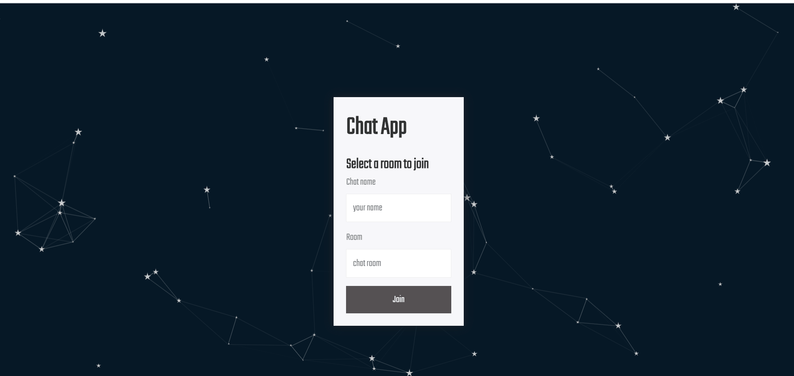

<br />
<p align="center">
 
  <h1 align="center">Websocket Chat App</h1>

  <p align="center">
    A chat app that uses socket.io
    <br />
  </p>
</p>

 

<!-- TABLE OF CONTENTS -->
## Table of Contents

* [About the Project](#about-the-project)
  * [Built With](#built-with)
* [Getting Started](#getting-started)
  * [Prerequisites](#prerequisites)
  * [Installation](#installation)
* [Try the demo](#try-it-now)


<!-- ABOUT THE PROJECT -->
## About The Project

This is a very simple chat app that allows multiple users to chat in chat rooms.

General usage of this app:
* User first enter a join page to provide a user name and a chat room to enter
* The server will redirect the user to their corresponding chat room
* User can then send text messages, images, or share their location in the chat

Each chat room has a profanity message filter, so no bad words are allowed :)

### Built With

* [NodeJS](https://nodejs.org/en/)
* [ExpressJS](https://expressjs.com/)
* [ES6](https://www.javascript.com/)
* [HTML5](https://developer.mozilla.org/en-US/docs/Web/Guide/HTML/HTML5)
* [CSS](https://developer.mozilla.org/en-US/docs/Web/CSS)


<!-- GETTING STARTED -->
## Getting Started

You can access this porject via git clone

### Prerequisites

* npm
```sh
npm install npm@latest -g
```
* NodeJS
* JavaScript

### Installation

1. Clone the repo
```sh
git clone https://github.com/Cindy1229/Chat-App.git
```
2. Install NPM packages
```sh
npm install
```
3. Run the server by the following command 
```sh
npm start
```
4. Open and browser and go to localhost:3000


<!-- Try it now -->
## Try it now

Heroku Link: [heroku](https://cindy-chat-app.herokuapp.com/)
